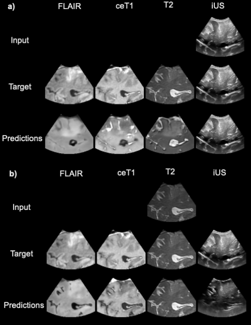

#  Unified Cross-Modal Image Synthesis with Hierarchical Mixture of Product-of-Experts

Public PyTorch implementation for our paper [Unified Cross-Modal Image Synthesis withHierarchical Mixture of Product-of-Experts](https://arxiv.org/pdf/2410.19378), 
currently under review. 

If you find this code useful for your research, please cite the following paper:

```
@article{dorent2024unified,
  title={Unified Cross-Modal Image Synthesis with Hierarchical Mixture of Product-of-Experts},
  author={Dorent, Reuben and Haouchine, Nazim and Golby, Alexandra and Frisken, Sarah and Kapur, Tina and Wells, William},
  journal={arXiv preprint arXiv:2410.19378},
  year={2024}
}
```

## Method Overview
We propose a deep mixture of multimodal hierarchical variational auto-encoders called MMHVAE that synthesizes missing images from observed images in different modalities. MMHVAE’s design focuses on tackling four challenges: 
1. creating a complex latent representation of multimodal data to generate high-resolution images
2. encouraging the variational distributions to estimate the missing information needed for cross-modal image synthesis
3. learning to fuse multimodal information in the context of missing data
4. leveraging dataset-level information to handle incomplete data sets at training time. 

*Example of multimodal synthesis using a) an ultrasound or b) a T2 scan as input. 
Three MR sequences (FLAIR, contrast-enhanced T1, T2) and ultrasound images are generated.*
<p align="center">
  
</p>


## Try MMHVAE to synthesize ultrasounds/MR

Once all the python packages are installed (see below), and download the models you can simply test MMHVAE on your own data with:

```python pred.py --model_dir pretrained/mmhvae_f0/ --input test/ --output output_test/```

## Installation

1. Clone this repository.
2. Create a virtual environment (i.e., with pip or conda) and install all the required packages.
   
   ```pip install -r requirements.txt```
3. Optional: Download the pre-trained models
   

## Run on your own data
### Training
Example of training command:
```
WEIGHT=0.025
FOLD=0

python train.py \
--model_dir ./models/fold$FOLD/mmhvae_$WEIGHT/ \
--dataset_split splits/split_empty_$FOLD.csv \
--path_data $WORK/data/TPAMI/data_unnorm/ \
--path_data_norm $WORK/data/TPAMI/data_norm/ \
--w_dis $WEIGHT
```
### Test
Example of training command:
```
WEIGHT=0.025
FOLD=0

python inference.py \
--model_dir ./models/fold$FOLD/mmhvae_$WEIGHT/ \
--dataset_split splits/split_empty_$FOLD.csv \
--path_data $WORK/data/TPAMI/data_unnorm/ \
--path_data_norm $WORK/data/TPAMI/data_norm/ \
--save_images 
```
